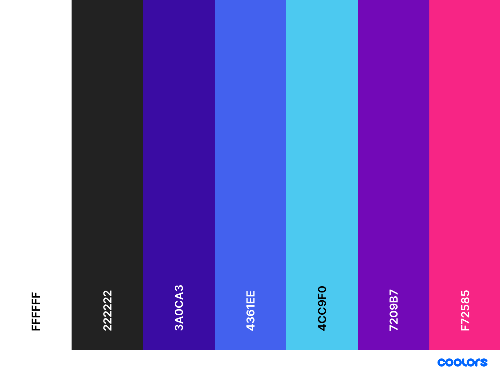

# Coached by Caoimhe

[Visit the live site here!](https://coached-by-caoimhe.herokuapp.com/)


## Table of Contents

1. [Overview](#overview)
2. [UX](#ux)
   - [Strategy](#strategy)
     - [Target Audience](#target-audience)
     - [Business Goals](#business-goals)
     - [User Stories](#user-stories)
   - [Scope](#scope)
   - [Structure](#structure)
   - [Wireframes](#wireframes)
   - [Surface](#surface)
     - [Typography](#typography)
     - [Colours](#colours)
     - [Images](#images)
3. [Features](#features)
   - [Current Features](#current-features)
   - [Future Features](#future-features)
4. [Tech Used](#tech-used)
   - [Languages](#languages)
   - [Frameworks & Libraries](#frameworks-libraries)
5. [Testing](#testing)
6. [Deployment](#deployment)
   - [Heroku](#heroku)
   - [AWS](#aws)
7. [Credits](#credits)

## Overview

Coached by Caoimhe is a web application that allows users to buy workout plans and be coached online and/or in person by a qualified personal trainer. This site you can find all the different workout plans and their details.

## UX

### Strategy

---

#### Target Audience

The target audience for this site are for people who want to be able to buy workout plans and be coached online and/or in person by a qualified personal trainer. Although this site targets a wide range of people its steered towards women who are looking to get back into shape post-pregnancy or maintain a great physique.

#### Business Goals

- To provide a navigable site that can entice users to sign up for coaching.
- Connect with users via social media and through subscriptions.
- Provide a way for users to buy workout plans and be coached online and/or in person by a qualified personal trainer.

#### User Stories

##### As a first time user, I want

- To easily understand the site and its features.
- To see clearly what the site has to offer.
- To be able to buy workout plans and be coached online and/or in person by a qualified personal trainer.
- Create an account and sign in to access the site.
- Know about the personal trainer and their qualifications.
- To easily find the contact information of the personal trainer.

##### As a recurring user, I want all of the above and

- To log in and sign up for coaching.
- To login in and check my profile.
- To have all my personal data stored.
- To have previous purchases stored.
- To have a secure way to pay for my workout plans.
- To receive a confirmation email when I buy a workout plan.
- To subscribe to the site and receive an email with the workout plan or information.

##### As the Admin/Site owner, I want

- To be able to add new workout plans.
- To be able to edit existing workout plans.
- To be able to delete existing workout plans.

---

### Scope

The following features are must have for this site to function, and are correlated to the user stories above.
Any features that are not included are optional and can be added later. Please check [Features](#features) to see a full list of current and future features.

- Clear and fully responsive design.
- Secure payment method.
- Secure authentication.
- User sign up and login.
- User profile.
- User workout plans.
- Full admin access.
- Error pages. (404, 500, etc.)

---

### Structure

Below is a description of the structure of the site.
**Note**: _The navbar and footer are included on all templates._

#### Home App

HTML

index.html

- This is the home page of the site, there is not much displayed on this page. There's an inspirational quote, a subtitle and a call to action button that are displayed.

#### Workouts App

HTML

add_workout.html

- This is the page where the admin can add their workout plans.

edit_workout.html

- This is the page where the admin can edit their workout plans.

workout_details.html

- This is the page where the user can view their workout plans. It shows name, description, price, how long it takes to complete, and the number of days it takes to complete. there is also a review container and review form.

workouts.html

- This is the page where the user can view all their workout plans or if the user picks a specific category it will display just those plans.

Models

Category

- It stores the workout plan categories.

Workout

- It stores the workout plans.

WorkoutReview

- It stores the workout reviews left by the users.

#### Cart App

HTML

Users can view their cart contents, remove any if required and continue securely to checkout.

#### Checkout App

HTML

Checkout.html

- Displays the final step before the user can pay for their workout plan. It shows the workout plan name, price, and the number of days it takes to complete. It also askes the user for billing information which will be stored in the database for future use. There's a stripe input that will take the credit card information. It also has a button to pay for the workout plan.

Checkout_success.html

- Displays a success message after the user has successfully paid for their workout plan. It also displays the order number the workout plan name, price, and the number of days it takes to complete.

Models

Order

- It stores the order information of each order and is created when the user completes the checkout.

OrderLineItem

- Contains information about each workout that's added to the cart.

#### Profiles App

HTML

profile.html

- Displays the user's profile. It shows the users billing information and their previously purchased workout plans.

Models

UserProfile

- Securely stores the user's billing information. It's used to store the user's billing information and pass it to the checkout form to speed up the purchase process.

#### Contact App

HTML

Contact.html

- Displays the contact information of the personal trainer. It shows the trainers email, phone number, and address. There's an embedded google map that shows the trainers location.

Models

Contact

- It stores the form details that the user submitted and is passed to the view. Which sends an email to the personal trainer with this information.

#### About App

HTML

About.html

- Displays the about page. Gives the user a brief description of the Personal trainer and what the have to offer.

#### Subscribe App

Models

Subscribe

- It stores the user's email address and is passed to the view. Which save the user's email address to the database for future use.

---

### Wireframes

<details>
<summary>Home</summary>


</details>

<details>
<summary>Workout Plans</summary>


</details>

<details>
<summary>Workout Plans Details</summary>


</details>

<details>
<summary>Checkout</summary>


</details>

<details>
<summary>Checkout Success</summary>


</details>

<details>
<summary>Sign Up</summary>


</details>

<details>

<summary>Sign In</summary>


</details>

<details>

<summary>Profile</summary>


</details>

<details>
<summary>Workout Plan Management</summary>


</details>

<details>
<summary>Contact Us</summary>


</details>

<details>
<summary>Error pages</summary>


</details>

---

### Surface

#### Colours

The colours used primarily in the site are:



#### Typography

I used the following fonts: `Corinthia`, `Lato`, `Playfair Display` and the classic `Sans Serif` font as a fallback.

#### Images

The imagery used throughout the site is allows the use to quickly identify and understand the site. I chose aesthetic imagery to help persuade the user into signing up for coaching.

---

## Features

### Current Features

Responsive Design

- The site is fully responsive and looks great on any device.

Navbar and Footer

- The navbar and footer are included on all templates. The site logo is located at the top left of the navbar and footer. The navbar has a search bar for quick access to the workout plans. All the links have a white font colour and a pink colour when hovered over which match the colour scheme of the site. Each link within the navbar are linked to all the correct templates the site has. The footer has a link to the contact page and a link to the about page and if the user isn't authenticated a login and signup link will be displayed. There is an email input in the footer which stores the user's email address for future use.

Bootstrap Toasts

- The site uses the bootstrap toasts to display various messages to the user. The user will see different messages depending on the page and the action that was performed.

Headers

- The site uses the `h1`, `h2`, `h3`, `h4` headers to display the content of the page. All the main headers throughout the site are `h1` with `hr` above and below them.

Buttons

- I used buttons throughout the site to display various actions. The buttons are all `btn` with a `btn-landing-page` class. The `btn-landing-page` class is used to match the colour scheme of the site and is primary used in forwarding the user to the checkout or through the site. The `btn-back` is used as a link to go back to the previous page and the colour scheme matches the sites colours.

#### Specific Features

Home

- The home pages displays an animated background and an inspirational quote. Below the is a sub-heading edges the user to click a button that takes the user to the workout plans page. There's not much on the home page other than the quote and the button, but I find it a great way to get the user into workout plans.

Workouts

- laid out in a grid for responsiveness.
- Workout images act as a link to the workout details page.
- A brief description of the workout is displayed below the image.
- A bright coloured button is displayed below the description which takes the user to the details page.
- Basic filters are available to filter the workouts by their category.

Workout Details

- Workout details have the image, name, description, price, and duration of the workout.
- Edit and delete buttons for admins
- A button is displayed below the details which takes the user to the checkout page.
- A button to go back to workouts
- An add to cart button is displayed below the details.
- Below the workout plan are reviews of that workout and a form to add a review if user has an account.

About

- 3 sections of information about the site and the personal trainer.
- Buttons on each section to take the user to the correct page.

Contact

- The contact page has a google map embedded to show the personal trainer's location.
- The contact page has a form to send an email to the personal trainer.
- The page has the contact information of the personal trainer.

Cart

- The cart page displays the cart items and the total cost of the cart.
- A button to checkout is displayed below the cart.
- A button to go back to the workouts page.
- A secure checkout button to lead the user to the checkout page.
- A button to remove an item from the cart.

Checkout

- The checkout page displays the cart items and the total cost of the items.
- A button to go back to the cart page.
- A stripe credit card input.
- Warning message that their card will be charged.
- A button to submit the order.

Checkout Success

- The checkout success page displays the order details, order number and the total cost of the order.
- The date and time of the order is displayed.
- A button to go back to the workouts page.
- A success toast is displayed to the user, with the order number and the email that will receive the conformation email.

Profile

- Shows the user their order history and their billing information.
- The ability to edit their billing information.

Sign In / Sign Up

- The sign in and sign up pages have a form to sign in and sign up.

Add Workouts

- Admin only page to add workouts to the site.
- Bootstrap 5 crispy form to generate the form.
- A button to add a workout.
- A button to go back to the workouts page.
- An input to add an image to the workout.

Edit Workouts

- Admin only page to edit workouts.
- Bootstrap 5 crispy form to generate the form using the information passed from the workout.id.
- Ability to remove the old image and replace with new image.

403/404/500 Error Pages

- Page displays from the templates folder when matching error occurs
- Large text to display the error message
- A button to go back to the home page

### Future Features

Social Media login

- Logging in via social media to assist with ease of access.

Fitness Forms

- A nice to have feature that didn't make it into the scope of the project.
- A form that would the user would fill out asking questions about health before checkout and be sent to the Trainer after checkout to assist in personalizing workouts.

Blog

- A nice to have feature that didn't make it into the scope of the project.
- A blog page for the Trainer to write and share their thoughts and tips on fitness and wellbeing, being hooked up to the emails that had been saved from the subscription input new posts and be mailed to the users.

Add Categories

- A feature to add categories to the workouts that I left out of the scope of the project.
- The admin would like to add categories to the workouts as the business grows but there wasn't a need for this feature at this point in time.
- If categories needed to be added, the admin could used the Django admin interface to add categories to the workouts.

## Tech Used

### Languages

- [HTML5](https://html.com/html5/)
- [CSS3](https://developer.mozilla.org/en-US/docs/Web/CSS)
- [JavaScript](https://developer.mozilla.org/en-US/docs/Web/JavaScript)
- [Python](https://www.python.org/)

### Frameworks & Libraries

- [Django](https://www.djangoproject.com/) - Used for the main framework for this site.
- [Bootstrap](https://getbootstrap.com/) - Used for the styling of the site.
- [Google Fonts](https://fonts.google.com/) - Used for the typography of the site.
- [Font Awesome](https://fontawesome.com/) - Used for the icons of the site.
- [SQLite3](https://www.sqlite.org/)n - Used for the development database of the site.
- [PostgreSQL](https://www.postgresql.org/) - Used for the Deployed database of the site.
- [Heroku](https://www.heroku.com/) - Used for the deployment of the site.
- [AWS](https://aws.amazon.com/) - Used for hosting images and static files.
- [VS Code](https://code.visualstudio.com/) - IDE used for the development of the site.
- [Git](https://git-scm.com/) - Used for the version control of the site.
- [GitHub](https://github.com/) - Used for storing the project files.
- [Balsamiq](https://www.balsamiq.com/) - Used for the wireframes.
- [jQuery](https://jquery.com/) - Used instead of vanilla JS.

## Testing

Find all the testing documentations [**here!**](TESTING.md)

## Deployment

Below describes the deployment of the site on Heroku and set up process to store static files and images on AWS.

### Heroku

- Go to [Heroku](https://www.heroku.com/)

- Create an account or log in if you already have an account.

- Create a new app and give it a unique name in only lowercase letters and numbers.

- Choose the nearest region to your location and click on "Create App".

- When the app has be created, click on the "Resources" tab to add the postgres database. Type in "Heroku Postgres" and select it
  _*This will create a DATABASE_URL in the Config Vars (which can be found in settings)*_

- Click on the "Deployment" tab.

- Select the option to "GitHub" and search for the project.

- Click on "Connect and enable automatic deployments"

- Move back to your IDE and `pip install dj_database_url` and `psycopg2-binary` to be able to use the postgres database.

- In the `settings.py` file, add the following lines:

```
DATABASES = {
    "default": dj_database_url.parse("database_url")
}
```

- Comment out the existing sqlite3 database.
  **PLEASE NOTE: Before committing and pushing to GitHub make sure to uncomment your sqlite3 to ensure this piece of code isn't committed to GitHub**

- Login to Heroku using the command line by typing `heroku login -i`

- Once logged in you will need migrate the models to the postgres database.

- Run the following command in the terminal:

  - `heroku run python manage.py makemigrations --dry-run` to see what changes will be made to the database.

  - `heroku run python manage.py makemigrations` to actually make the changes to the database.

  - `heroku run python manage.py migrate --plan` to see what will be migrated.

  - `heroku run python manage.py migrate` to actually migrate the database.

- You will now need to create a superuser to access the admin side of the site.

  - `heroku run python manage.py createsuperuser`

- Install the `gunicorn` package by typing `pip install gunicorn`

- Now you can create your requirements.txt file by typing `pip freeze > requirements.txt`

- Create a `Procfile` file by typing `touch Procfile`

---

[How to add table in markdown](https://www.markdownguide.org/extended-syntax/)

| Key                   | Value                    |
| --------------------- | ------------------------ |
| AWS_ACCESS_KEY_ID     | `aws_access_key`         |
| AWS_SECRET_ACCESS_KEY | `aws_secret_access_key`  |
| DATABASE_URL          | `auto-generated`         |
| DEVELOPMENT           | `True` _or_ `False`      |
| EMAIL_HOST_PASS       | `email_key`              |
| EMAIL_HOST_USER       | `your_email`             |
| GOOGLE_MAPS_API_KEY   | `YOUR_MAPS_API_KEY`      |
| SECRET_KEY            | `secret_key`             |
| STRIPE_PUBLIC_KEY     | `your_stripe_public_key` |
| STRIPE_SECRET_KEY     | `your_stripe_secret_key` |
| STRIPE_WH_SECRET      | `stripe_webhook_key`     |
| USE_AWS               | `True`                   |

**PLEASE NOTE:**
Its important are spelt correctly and update for this to work. Your Config Vars should look the left side and your unique keys should be on the right side.

---

### AWS s3

#### How to set up AWS s3

1. Go to [AWS](https://aws.amazon.com/) and login to your account. If you don't have an account, create one. If you have to create an account be mindful that you will need to enter your card details, no billing will occur unless you go over the free tier limit.

2. After logging in, go to the [S3](https://console.aws.amazon.com/s3/) and create a bucket.

3. Make sure you name your bucket the same as you did for Heroku and choose the nearest region to your location.

4. Scroll down to the "Block Public Access" section and unchecked the "Block public access" checkbox. Confirm that you want to allow access to the bucket. Scroll down to the bottom of the page and click on "Create bucket"

---

#### Customizing the bucket properties

1. Click on the Properties tab. Scroll to the end of that page and click on edit button.

2. At the top it will allow you to choose between "Enable" and "Disable" static website hosting. Choose Enable.

3. The section below will allow you to select "Host a static website", Select "Host a static website" and then scroll down to the index "Document inputs"

4. In the input field, enter the home file which is the "index.html" file and in the error field, enter "error.html".

5. Leave the redirection rules empty and click on "Save changes".

---

#### Setting up the Permissions

1. Next, go to the permissions tab. Scroll down to the bottom of the page and click edit the "Cross-Origin Resource Sharing (CORS)" section.

2. Add the following lines:

```
[{
  "AllowedHeaders": ["
  Authorization"
  ],
  "AllowedMethods": [
    "Get"
    ],
  "AllowedOrigins": [
    "*"
    ],
  "ExposeHeaders": [],
}]

```

3. Save the changes. Navigate to "Bucket Policy" section and click "edit"

#### Generating A Bucket Policy

1. Click on the "Policy Generator" button. Select "S3 Bucket Policy" from the dropdown list.

2. You will need to set following permissions:

   - Effect – Allow
   - Principle - \*
   - Actions – GetObject, GetObjectAcl, PutObject, PutObjectAcl and DeleteObject
   - Amazon Resource Name – This can be found on the previous page, under "Bucket ARN". Copy and paste it into this box

3. After these have been entered, click "Add Statemen" and "Generate Policy".

4. Copy the policy into the bucket policy editor, adding `/*` onto the end, the click "Save Changes".

---

#### Access Control List

1. While in the permissions tab, click "edit" under the "Access Control List" section.

2. Next, navigate to "Everyone (public access)" and tick the box on the left, "List" under the "Objects" heading. Tick the box that you understand the effect then click on "Save Changes".

---

#### Creating A Group and Policy with IAM

1. Next, search for IAM in the search bar at the top, and click on it to set up a group policy.

2. Under "Access Management", Select "User Groups" and create a new group.

3. Give the group a name (try keep it relational to the project name) and click "Create Group".

4. This will bring you to the IAM dashboard. Go to the "Access Management" section, and click on "Policies".

5. Click "Create Policy" and click on the JSON tab, and select "Import Managed Policy".

6. Search for "AmazonS3FullAccess" and select it, then Import".

7. Copy your ARN and place it in the code twice (the second time with `/*`) so that it looks like the below;

```
{
    "Version": "2012-10-17",
    "Statement": [
        {
            "Effect": "Allow",
            "Action": [
                "s3:*",
                "s3-object-lambda:*"
            ],
            "Resource": [
                "arn:aws:s3:::YOUR-ARN",
                "arn:aws:s3:::YOUR-ARN/*"
            ]
        }
    ]
}
```

8. Select "Next: Tags", "Next: Review", Enter a name and click on "Create Policy".

---

#### Attaching the Group Policy

1. Go to "User Groups", under "Access Management". Click on the your newly created group and go over to the "Permissions" tab

2. Select the "Add Permissions" button, and select "Attach Policy".

3. Search for and click on the checkbox next to the policy you have just created, then Select "Add Permissions".

---

#### Create User for IAM

1. Head back to the IAM dashboard, click on "Users", then "Add User".

2. Choose a name and tick the checkbox to give the user access, then select "Next: Permissions".

3. Select the group to put the user in and keep clicking the next buttons until the very end and click "Create user".

4. Click on “Download .csv” file (**Keep this is a secure location as you wont be able to get these details again**), as you will not have access to this page again! This file will contain information required as shown in the Heroku table above.

---

#### **_PLEASE NOTE_**

these changes must be made in your settings.py file.

```
if 'USE_AWS' in os.environ:
    AWS_STORAGE_BUCKET_NAME = 'your_bucket_name'
    AWS_S3_REGION_NAME = 'your_region'
    AWS_ACCESS_KEY_ID = os.environ.get('AWS_ACCESS_KEY_ID')
    AWS_SECRET_ACCESS_KEY = os.environ.get('AWS_SECRET_ACCESS_KEY')
    AWS_S3_CUSTOM_DOMAIN = f'{AWS_STORAGE_BUCKET_NAME}.s3.amazonaws.com'
```

---

### Saving Images To S3 Bucket

If you need to save images to your S3 bucket, you will need to do the following;

1. Go to the s3 dashboard and click on the bucket you want to save the images to.

2. Click "Create Folder", call it "media" and click the second "Create Folder" button.

3. When you are in this folder, click "Upload", then 'Add Files" or "Add Folder", then "Upload".

---

## Credits

### Code

- How to add dropdown content in markdown was found [here](https://dev.to/asyraf/how-to-add-dropdown-in-markdown-o78).

- Assistance with creating the contact form was found [**here**](https://ordinarycoders.com/blog/article/build-a-django-contact-form-with-email-backend).

- The embedded google map was created here [**here**](https://developers.google.com/maps/documentation/embed/map-generator).

- Layout inspired by Bootstrap jumbotron, found [**here**](https://getbootstrap.com/docs/5.1/examples/jumbotron/).

- How to add a functioning review form was from here [**here**](https://www.youtube.com/watch?v=Y5vvGQyHtpM).

### Image

- The website used to remove the background of an image was found [**here**](https://www.remove.bg/)

- Images for workouts were taken from [**FreePik**](https://www.freepik.com/free-photos-vectors/workout)

- 2 images used for workouts were taken from [**Pexels**](https://www.pexels.com/)

- The image used for a plan with no image was taken from the CI walkthrough project which can be found [**here**](https://github.com/Code-Institute-Solutions/boutique_ado_v1/blob/4b28dfe82da5e5e24ed830f15ebe4f70deca8886/media/noimage.png)

## Acknowledgements

- I would like to thank [**Code Institute**](https://www.codeinstitute.net/) for the support and guidance.

- All the students past and present at Code Institute helped me with my project.

- My mentor Caleb Mbakwe for his guidance and support throughout this course.
